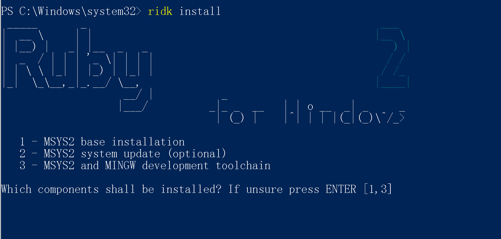
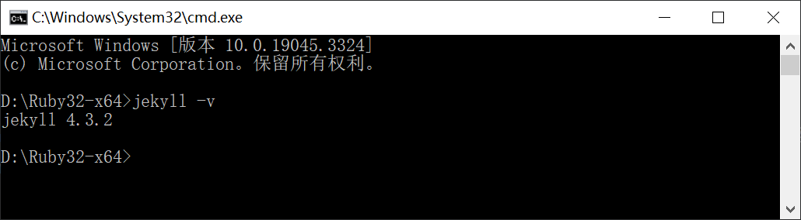
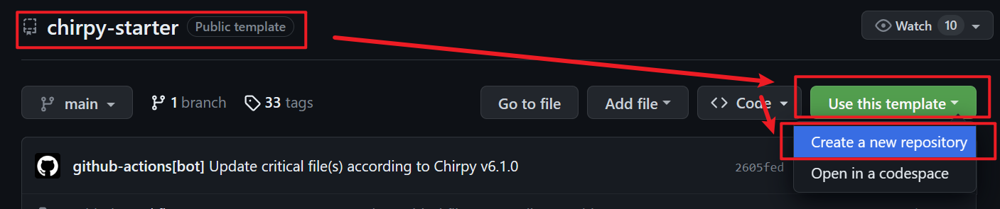
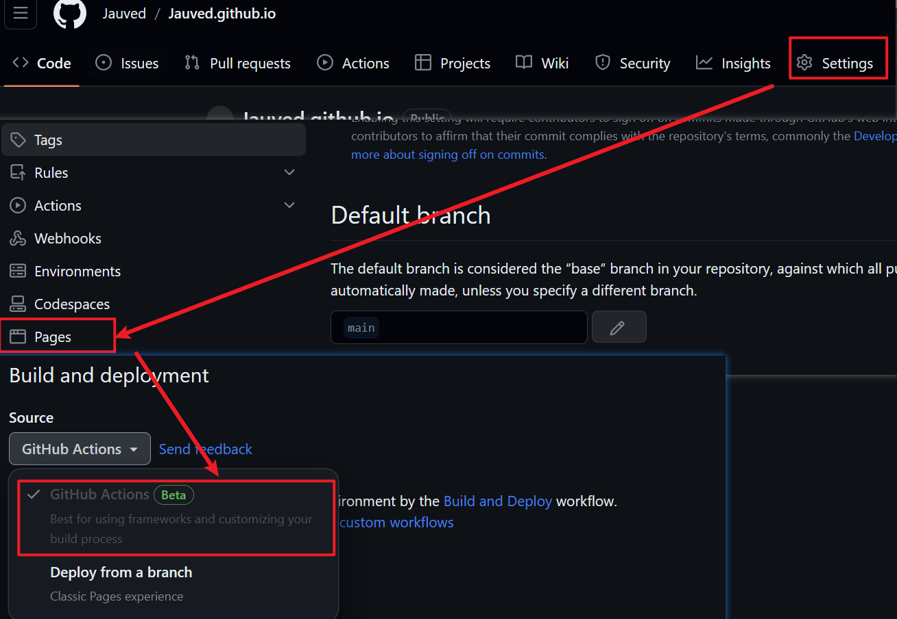
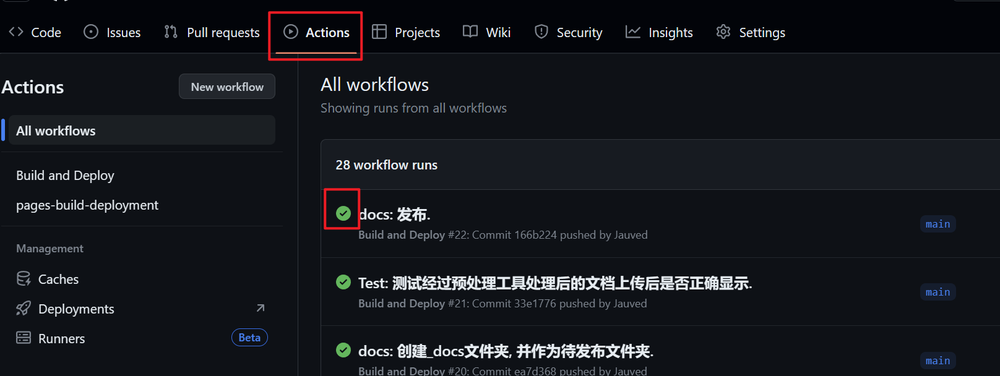

# 基于Jekyll和Github的Blog搭建

## 0. 起因

搭建一个基于Github Page的博客用来记录学习到的技巧和案例, 之前的选型是[Rentry.co - Markdown Pastebin](https://rentry.org/), 但每个文件需要记录一个Edit Code, 以及图床的问题, 于是开始搜索其他的方式. 最终选定了Github Page. 而搭建基于Github Page的博客, 按照官网的建议, 采用[Jekyll](https://jekyllrb.com/docs/). 于是, 痛苦踩坑之路开始了. 按照下面的步骤一步一步开始搭建自己的Blog.

## 1. 安装Jekyll编译需要的库和依赖

如果你不需要本地编译预览的话, 可以跳过这一步, 但我相信, 你不会喜欢每次上传仓库才能看到最终效果的. 所以还是先安装为好., 具体步骤参看[Jekyll on Windows ](https://jekyllrb.com/docs/installation/windows/), 整理如下:

- 下载和安装[**Ruby+Devkit**](https://rubyinstaller.org/downloads/);(**Ruby的安装路径中不能有空格, 所以不建议安装在`Program Files`中, 笔者是直接安装在D盘根目录下**)

  - **之后如果需要手动输入命令行请在Ruby的安装目录中进行, 即在`Ruby32-x64`目录中, 通过在路径处输入`cmd`来启动命令行.**
    
    

- 以**管理员权限**运行安装完之后, 会自动执行命令行(如果此时错过了, 可以之后在命令行中手动执行)`ridk install`, 此时默认选择安装`[1,3]`项, 回车即可;
  

- 然后命令行执行`gem install jekyll bundler`, 安装jekyll;(此时如果有梯子, 可能会产生反效果, 可以关闭后尝试)

- 最后执行`jekyll -v`，看是否成功安装, 成功的话, 会在命令行中显示jekyll的版本号.
  

- 此时Jekyll布置完毕.

  

## 2. 选择Theme

> 为什么先选择Theme?
正常来说, 先建立`##username.github.io`的仓库, 然后复制theme并上传进行修改. 但这	次我选择theme功能有些复杂, 涉及到一些JS的编译, 所以先选择Theme, 然后按照Theme对应	的Guide一步一步来处理是更好的选择.
{: .prompt-info }

前往[Jekyll Themes](http://jekyllthemes.org/), 选中了`Chirpy`这个theme, 点击进入到Theme中.

点击Demo->Getting Started


## 3. 基于作者的[Github工程](https://github.com/cotes2020/chirpy-starter)创建自己的Blog工程


创建出的工程名称为`USERNAME.github.io`, 其中`USERNAME` 需要修改为你自己的Github名称. 比如笔者的就是`Jauved.github.io`. 

## 4. [开始部署基础环境并运行本地端](https://chirpy.cotes.page/posts/getting-started/)

- 通过Git拉取创建的工程

- 在工程根目录下执行命令行`bundle`, 此时会下载依赖库(梯子可能有反作用)(**这个步骤中的命令行都在工程的根目录下执行**)

- 打开根目录下的`_config.yml`进行配置, 笔者修改的项目如下

  - `lang: zh-CN`

  - `timezone: Asia/Shanghai`, 时区的话, 哪个地方都行.

  - `title: Jauved`, 这里需要换成你自己的名字.

  - `tagline: 一个学徒`, 这里自行发挥.

  - ```console
    description: >- # used by seo meta and the atom feed
    	 记录技术点的博客
    ```
  - `url: 'https://jauved.github.io/'`, 这里需要将`jauved`替换为你的名字.
  - 后面的Github, twitter, 等等相关信息都替换为你自己的.
  - `avatar: 'avatar.jpg'`, 头像路径, 笔者直接丢在了根目录, 可以按照需要放在其他地方, 最好是方形图片.

- 运行命令行`bundle exec jekyll s`可以开启本地测试端, 开启后, 访问地址为`http://127.0.0.1:4000/`

- 建议制作为一个.bat文件, 文件放置在工程根目录下, 内容如下

  ```console
  @echo off
  bundle exec jekyll s
  ```

## 5. [上传第一个文件](https://chirpy.cotes.page/posts/write-a-new-post/)

### 5.1 前置需求

- 上传的文件名格式需要是"YYYY-MM-DD-title"

- 然后需要在md文档中最上方加入`Front Matter`, 代码行如下

  ```yaml
  ---
  layout: layout: post	# 这一行可以不用写, 默认就是该值
  title: TITLE	# 标题, 中文的话需要用""包裹
  date: YYYY-MM-DD HH:MM:SS +/-TTTT	# 这一行可以不用写
  categories: [TOP_CATEGORIE, SUB_CATEGORIE]	# e.g. [Unity, PBR]
  tags: [TAG]     # 这里有点坑看例子就懂了, 用空格分割, 且不需要[]包裹, e.g. ComputeShader 视锥体剔除
  ---
  ```
  
- 进入你的Github工程, 依次点击`Settings`->`Pages`->`Source`切换为`Github Actions`

  

### 5.2 上传

- 将要上传的文件放置在`_posts`文件夹下.

- 在提交之前建议先从本地进行预览.

- 任何的**提交**动作, 都会自动触发`Github Actions`.

- 提交完毕之后, 通过`Action`页签, 检查是否有错误, 如果有错误, 看下报错码来解决.

  

- 访问`https://jauved.github.io/`, 其中`jauved`替换为你自己的名字, 就可以访问到你布置的Blog了.

## 6. 其他坑

- Typora兼容

  - 笔者使用Typora作为写作的软件, 而Jekyll使用的md语言是属于kramdown方言, 两者的语法会有差异

  - 参考[jekyll下Markdown的填坑技巧 \| Weclome to eipi10](https://eipi10.cn/others/2019/12/07/jekyll-markdown-skills/), 进行处理.(笔者还没有开始处理, 开始处理后会尝试写相关的Blog)

  - Typora本地的图片加载和Jekyll的加载策略不同, 网站显示正常的图片在本地显示不正常.

    - 笔者在工程根目录下创建了一个`_docs`目录, 将文章源文件放置在里面

    - 在`_docs`目录下放置一个`.assets/image/`文件夹用来放置图片, 设置好Typora.

    - 然后通过python的脚本, 完成以下工作

      - 文本格式预处理(还没有开始做)

      - 将`_docs/.assets/image/`下的文件全部拷贝到`/assets/image/`中

      - 将`_docs`下的`.md`文件拷贝到`_post`文件夹下, 并将其中的`.assets/image`/替换为`/assets/image/`.

      - 再将`.md`文件重命名为`.markdown`.

      - 脚本代码附在文章最后.


## 7. 附录: 

###### 参考网页

- [Jekyll Themes](http://jekyllthemes.org/)
- [Getting Started \| Chirpy (cotes.page)](https://chirpy.cotes.page/posts/getting-started/)
- [Writing a New Post \| Chirpy (cotes.page)](https://chirpy.cotes.page/posts/write-a-new-post/)
- [Jekyll模板升级笔记 \| 不太皮的九叔 (ny9s.com)](https://github.ny9s.com/JekyllfastStart/)
- [kukisama/kukisama.github.io at gh-pages](https://github.com/kukisama/kukisama.github.io/tree/gh-pages)
- [Markdown 基本语法 \| Markdown指南中文版](https://www.markdown.xyz/basic-syntax/#code)
- [关于博客搭建过程的一些总结和吐槽 \| Sharzy](https://sharzy.in/posts/2019-08-08-pitfall/)
- [jekyll下Markdown的填坑技巧 \| Weclome to eipi10](https://eipi10.cn/others/2019/12/07/jekyll-markdown-skills/)
- [kramdown基本语法 - 知乎 (zhihu.com)](https://zhuanlan.zhihu.com/p/60838339)
- [kramdown和markdown较大的差异比较 \| Hom (gohom.win)](http://gohom.win/2015/11/06/Kramdown-note/)


###### 脚本代码

```python
        import os
        import shutil
        import re
        import sys
        
        if getattr(sys, 'frozen', False):
            # 如果脚本被编译成了一个可执行文件
            script_dir = os.path.dirname(sys.executable)
        else:
            # 如果脚本是直接从Python源文件运行的
            script_dir = os.path.dirname(os.path.abspath(__file__))
        
        
        # Step 1: 复制前的文档格式处理
        def pre_copy_formatting():
            # 此处留空，将来用于处理复制前的文档格式
            pass
        
        
        # Step 2: 文件迁移
        def file_migration():
            # 获取脚本文件所在的绝对路径
            # script_dir = os.path.dirname(os.path.abspath(__file__))
            source_dir = script_dir
            target_dir = os.path.join(script_dir, "../_posts")
        
            # 检查目标文件夹是否存在，如果不存在则创建
            if not os.path.exists(target_dir):
                user_input = input("目标文件夹(_posts)不存在, 是否需要创建? (y/n, default is y): ").strip().lower()
                if user_input == "y" or user_input == "":
                    try:
                        os.makedirs(target_dir)
                        print(f"目标文件夹 '{target_dir}' 已创建.")
                    except Exception as e:
                        print(f"创建目标文件夹时发生错误: {e}")
                        return
                else:
                    print("File migration aborted.")
                    return
        
            # 获取源目录中的所有文件和文件夹
            all_items = os.listdir(source_dir)
        
            # 打印所有找到的项目（用于调试）
            # print(f"All items in source directory ({len(all_items)}):")
            # for item in all_items:
            #     print(f"  - {item}")
        
            # 获取所有.md文件的列表
            md_files = [f for f in all_items if f.endswith(".md") and f != os.path.basename(__file__)]
        
            # 打印.md文件的数量和名称
            print(f"\nFound {len(md_files)} .md files:")
            for file_name in md_files:
                print(f"  - {file_name}")
        
            # 询问用户是否要继续
            user_input = input("是否进行文件迁徙? (y/n, default is y ): ").strip().lower()
            if user_input == "y" or user_input == "":
                # 如果用户选择继续或直接按回车，则复制文件
                for file_name in md_files:
                    full_file_name = os.path.join(source_dir, file_name)
                    if os.path.isfile(full_file_name):
                        try:
                            shutil.copy(full_file_name, target_dir)
                            print(f"Copied {file_name} to {target_dir}")
                        except Exception as e:
                            print(f"复制文件时发生错误: {e}")
            else:
                # 如果用户选择不继续，则退出
                print("File migration aborted.")
                return
        
        
        # Step 3: 图片迁移
        def image_migration():
            # 获取脚本文件所在的绝对路径
            # script_dir = os.path.dirname(os.path.abspath(__file__))
            source_dir = os.path.join(script_dir, ".assets/image")
            target_dir = os.path.join(script_dir, "../assets/image")
        
            # 检查源文件夹是否存在
            if not os.path.exists(source_dir):
                print(f"源文件夹 '{source_dir}' 不存在.")
                return
        
            # 检查目标文件夹是否存在，如果不存在则创建
            if not os.path.exists(target_dir):
                user_input = input("目标文件夹(assets/image)不存在, 是否需要创建? (y/n, default is y): ").strip().lower()
                if user_input == "y" or user_input == "":
                    try:
                        os.makedirs(target_dir)
                        print(f"目标文件夹 '{target_dir}' 已创建.")
                    except Exception as e:
                        print(f"创建目标文件夹时发生错误: {e}")
                        return
                else:
                    print("Image migration aborted.")
                    return
        
            # 获取源目录中的所有文件和文件夹
            all_items = os.listdir(source_dir)
        
            # 打印所有找到的项目（用于调试）
            # print(f"All items in source directory ({len(all_items)}):")
            # for item in all_items:
            #     print(f"  - {item}")
        
            # 获取所有图片文件的列表
            image_files = [f for f in all_items if f.endswith(("png", "jpg", "jpeg", "gif", "bmp"))]
        
            # 打印图片文件的数量和名称
            print(f"\nFound {len(image_files)} image files:")
            for file_name in image_files:
                print(f"  - {file_name}")
        
            # 询问用户是否要继续
            user_input = input("是否进行图片迁徙? (y/n, default is y): ").strip().lower()
            if user_input == "y" or user_input == "":
                # 如果用户选择继续或直接按回车，则复制文件
                for file_name in image_files:
                    full_file_name = os.path.join(source_dir, file_name)
                    if os.path.isfile(full_file_name):
                        try:
                            shutil.copy(full_file_name, target_dir)
                            print(f"Copied {file_name} to {target_dir}")
                        except Exception as e:
                            print(f"复制文件时发生错误: {e}")
            else:
                # 如果用户选择不继续，则退出
                print("Image migration aborted.")
        
        
        # Step 4: 更新图片链接
        def update_image_links():
            # 获取脚本文件所在的绝对路径
            # script_dir = os.path.dirname(os.path.abspath(__file__))
            target_dir = os.path.join(script_dir, "../_posts")
        
            # 检查目标文件夹是否存在
            if not os.path.exists(target_dir):
                print(f"目标文件夹 '{target_dir}' 不存在.")
                return
        
            # 获取目标目录中的所有文件和文件夹
            all_items = os.listdir(target_dir)
        
            # 获取所有.md文件的列表
            md_files = [f for f in all_items if f.endswith(".md")]
        
            # 打印.md文件的数量和名称
            print(f"\nFound {len(md_files)} .md files:")
            for file_name in md_files:
                print(f"  - {file_name}")
        
            # 询问用户是否要继续
            user_input = input("是否将图片链接按照发布格式更新? (y/n, default is y): ").strip().lower()
            if user_input == "y" or user_input == "":
                # 如果用户选择继续或直接按回车，则更新每个文件中的图片链接
                for file_name in md_files:
                    full_file_name = os.path.join(target_dir, file_name)
                    if os.path.isfile(full_file_name):
                        try:
                            # 打开文件并读取内容
                            with open(full_file_name, 'r', encoding='utf-8') as file:
                                content = file.read()
        
                            # 找到并打印所有匹配的图片链接
                            matched_links = re.findall(r'\.assets/image/(.+?\.(png|jpg|jpeg|gif|bmp))', content)
                            print(f"\nFound {len(matched_links)} matched links in {file_name}:")
                            for link in matched_links:
                                print(f"  - {link[0]}")
        
                            # 更新图片链接
                            updated_content = re.sub(r'\.assets/image/(.+?\.(png|jpg|jpeg|gif|bmp))', r'/assets/image/\1',
                                                     content)
        
                            # 将更新后的内容保存回文件
                            with open(full_file_name, 'w', encoding='utf-8') as file:
                                file.write(updated_content)
        
                            print(f"Updated image links in {file_name}")
                        except Exception as e:
                            print(f"处理文件时发生错误: {e}")
            else:
                # 如果用户选择不继续，则退出
                print("Update image links aborted.")
        
        
        # Step 5: 更新文件扩展名
        def update_file_extension():
            # 获取脚本文件所在的绝对路径
            # script_dir = os.path.dirname(os.path.abspath(__file__))
            target_dir = os.path.join(script_dir, "../_posts")
        
            # 检查目标文件夹是否存在
            if not os.path.exists(target_dir):
                print(f"目标文件夹 '{target_dir}' 不存在.")
                return
        
            # 获取目标目录中的所有文件和文件夹
            all_items = os.listdir(target_dir)
        
            # 获取所有.md文件的列表
            md_files = [f for f in all_items if f.endswith(".md")]
        
            # 打印.md文件的数量和名称
            print(f"\nFound {len(md_files)} .md files:")
            for file_name in md_files:
                print(f"  - {file_name}")
        
            # 询问用户是否要继续
            user_input = input("是否将处理后的文件的扩展名从.md更新为.markdown? (y/n, default is y): ").strip().lower()
            if user_input == "y" or user_input == "":
                # 如果用户选择继续，则更改每个文件的扩展名
                for file_name in md_files:
                    full_file_name = os.path.join(target_dir, file_name)
                    new_file_name = os.path.splitext(full_file_name)[0] + ".markdown"
        
                    # 检查新的文件名是否已经存在
                    if os.path.exists(new_file_name):
                        os.remove(new_file_name)
                        print(f"Existing file {new_file_name} has been removed.")
        
                    os.rename(full_file_name, new_file_name)
                    print(f"Changed extension of {file_name} to .markdown")
            else:
                # 如果用户选择不继续，则退出
                print("Update file extension aborted.")
        
        
        # 主函数，依次调用上述五个函数
        def main():
            pre_copy_formatting()
            file_migration()
            image_migration()
            update_image_links()
            update_file_extension()
        
        
        # 如果这个脚本是直接运行的，则调用main函数
        if __name__ == "__main__":
            main()
        
```

